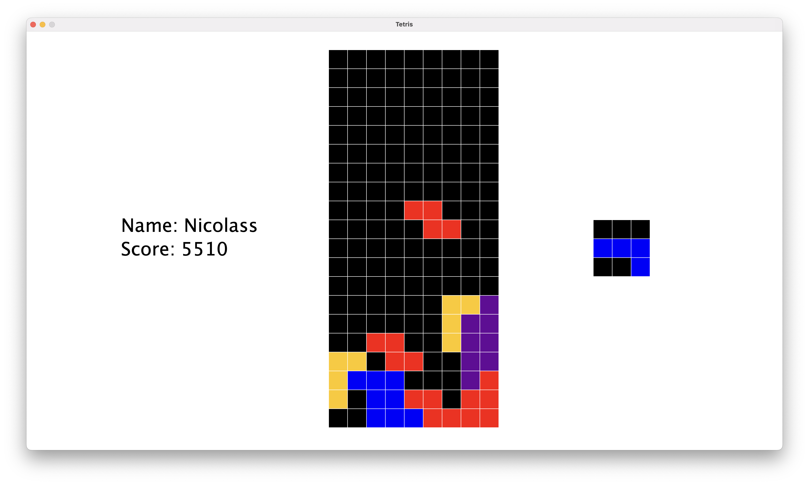
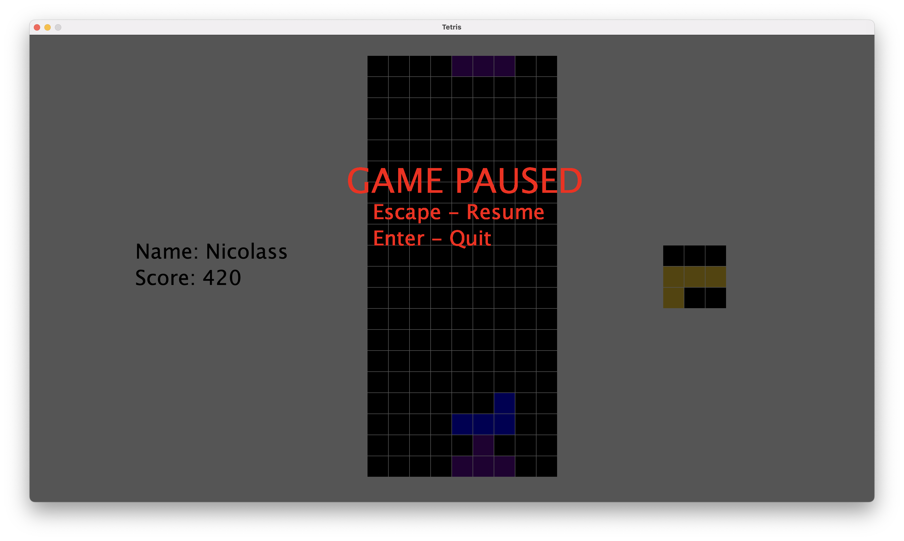
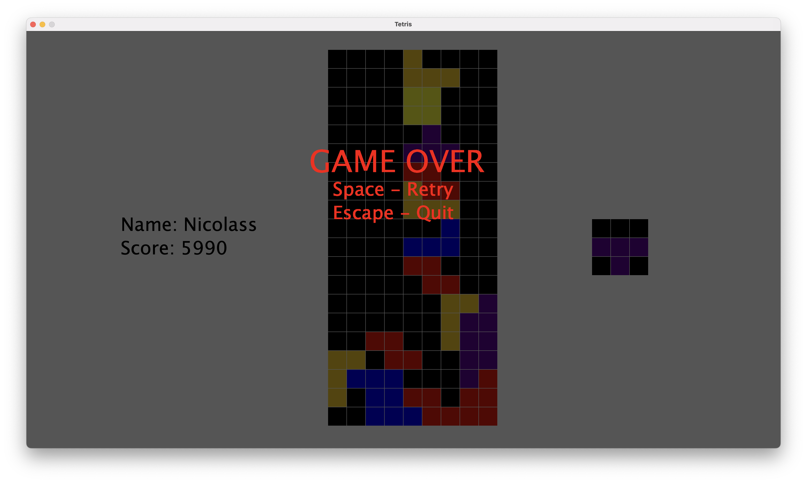

# Tetris - Java

This project is a Tetris' copy in develop in Java. A lot of design pattern were be used to develop this project.

# Summary

* **[Summary](#summary)**
* **[Credits](#credits)**
* **[Features](#features)**
  * **[State design pattern](#state-design-pattern)**
* **[Version](#version)**

# Credits

* **[FACON Nicolas](github.com/FACON-Nicolas)**

# Features

## state design pattern

Thanks to a state game developed with the state design pattern, I developped a paused game mode in the tetris 

but also a game over state

the runnning game turns on a state too, the running game state.

# Version

* **1.0** : 2023-02-25